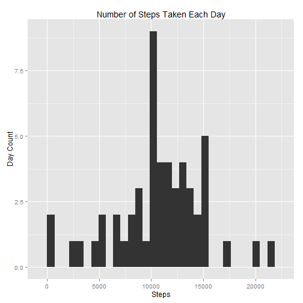
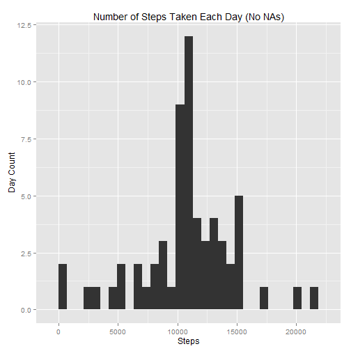
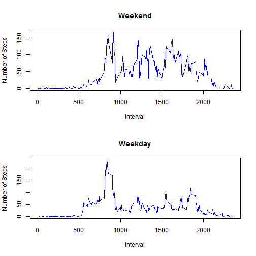

# Reproducible Research: Peer Assessment 1


## Loading and preprocessing the data
Assumes your current working directory is where this assignment is located
and that it includes the activity.zip file

Further assumes that the reshape2 library package has already been installed
Further assumes that the ggplot2 library package has already been installed

- 1

```r
unzip("activity.zip")
activity <- read.csv("activity.csv", header = TRUE)
```


- 2

```r
library(reshape2)
activity_daily_steps <- dcast(melt(activity, id = c("date")), date ~ variable, 
    fun.aggregate = sum)[1:2]

activity_daily_pattern <- dcast(melt(activity, id = c("interval"), measure = c("steps")), 
    interval ~ variable, fun.aggregate = mean, na.rm = TRUE)[1:2]
```


## What is mean total number of steps taken per day?

- 1

```r
library(ggplot2)
qplot(activity_daily_steps$steps, data = activity_daily_steps, geom = "histogram", 
    xlab = "Steps", ylab = "Day Count", main = "Number of Steps Taken Each Day")
```

```
## stat_bin: binwidth defaulted to range/30. Use 'binwidth = x' to adjust this.
```

 

```r
mean_daily_steps <- mean(activity_daily_steps$steps, na.rm = TRUE)
median_daily_steps <- median(activity_daily_steps$steps, na.rm = TRUE)
```


- 2

The mean steps taken every day is 

```r
mean_daily_steps
```

```
## [1] 10766
```

The median steps taken every day is

```r
median_daily_steps
```

```
## [1] 10765
```


## What is the average daily activity pattern?

- 1

```r
qplot(x = activity_daily_pattern$interval, y = activity_daily_pattern$steps, 
    data = activity_daily_pattern, geom = "line", xlab = "Interval", ylab = "Steps", 
    main = "Average Daily Activity Pattern")
```

 


- 2

The maximum average 5 minute time interval is:

```r
activity_daily_pattern[activity_daily_pattern$steps == max(activity_daily_pattern$steps), 
    1]
```

```
## [1] 835
```


## Imputing missing values

- 1 Total Number of missing values:

```r
length(activity[activity$steps == "NA", 1])
```

```
## [1] 2304
```

- 2 A worthy strategy to fill in missing values in the dataset would be to 
take the mean of the 5 minute interval to fill in the corresponding missing 5
minute interval. This assumes that number of steps is mainly a function of each
5 minute interval and doesn't depend on the day of week, past step activity, or
other potential confounding variables.

- 3 The following is a new dataset based upon this strategy:


```r
activity_complete <- data.frame(steps = numeric(), date = factor(), interval = integer())
i <<- 1
while (i <= nrow(activity)) {
    current_state <- activity[i, ]
    if (is.na(activity[i, 1]) == TRUE) {
        insert_row <- as.data.frame(c(activity_daily_pattern[activity_daily_pattern$interval == 
            activity[i, 3], 2], activity[i, 2:3]))
        names(insert_row) = c("steps", "date", "interval")
        activity_complete <<- rbind(activity_complete, insert_row)
    } else {
        insert_row <- as.data.frame(activity[i, ])
        names(insert_row) = c("steps", "date", "interval")
        activity_complete <<- rbind(activity_complete, insert_row)
    }
    i <<- i + 1
}
```


- 4 The following is a histogram of the total number of steps taken each day.


```r
activity_daily_steps_complete <- dcast(melt(activity_complete, id = c("date")), 
    date ~ variable, fun.aggregate = sum)[1:2]
qplot(activity_daily_steps_complete$steps, data = activity_daily_steps_complete, 
    geom = "histogram", xlab = "Steps", ylab = "Day Count", main = "Number of Steps Taken Each Day (No NAs)")
```

```
## stat_bin: binwidth defaulted to range/30. Use 'binwidth = x' to adjust this.
```

 

```r
mean_daily_steps_complete <- mean(activity_daily_steps_complete$steps, na.rm = TRUE)
median_daily_steps_complete <- median(activity_daily_steps_complete$steps, na.rm = TRUE)
```


The mean steps taken every day (with no NAs in the data):

```r
mean_daily_steps_complete
```

```
## [1] 10766
```


The median steps taken every day (with no NAs in the data):

```r
median_daily_steps_complete
```

```
## [1] 10766
```


These two new values for the mean and median don't vary significantly (if at
all) since the mean values were used to fill in the missing NA values. The
impact is that the distribution will be more concentrated towards the mean.

## Are there differences in activity patterns between weekdays and weekends?

- 1

The following code changes the date column to date datatype and binds a new
factor variable column with two levels - "weekday" or "weekend"


```r
activity_complete[, 2] <- as.Date(activity_complete[, 2])
activity_complete <- cbind(activity_complete, weekday = weekdays(activity_complete[, 
    2]))
levels(activity_complete$weekday) <- c(levels(activity_complete$weekday), "weekend", 
    "weekday")
activity_complete[activity_complete$weekday == "Saturday" | activity_complete$weekday == 
    "Sunday", 4] <- "weekend"
activity_complete[activity_complete$weekday != "weekend", 4] <- "weekday"
activity_complete$weekday <- factor(activity_complete$weekday)

summary(activity_complete)
```

```
##      steps            date               interval       weekday     
##  Min.   :  0.0   Min.   :2012-10-01   Min.   :   0   weekend: 4608  
##  1st Qu.:  0.0   1st Qu.:2012-10-16   1st Qu.: 589   weekday:12960  
##  Median :  0.0   Median :2012-10-31   Median :1178                  
##  Mean   : 37.4   Mean   :2012-10-31   Mean   :1178                  
##  3rd Qu.: 27.0   3rd Qu.:2012-11-15   3rd Qu.:1766                  
##  Max.   :806.0   Max.   :2012-11-30   Max.   :2355
```

```r
str(activity_complete)
```

```
## 'data.frame':	17568 obs. of  4 variables:
##  $ steps   : num  1.717 0.3396 0.1321 0.1509 0.0755 ...
##  $ date    : Date, format: "2012-10-01" "2012-10-01" ...
##  $ interval: int  0 5 10 15 20 25 30 35 40 45 ...
##  $ weekday : Factor w/ 2 levels "weekend","weekday": 2 2 2 2 2 2 2 2 2 2 ...
```


- 2


```r
# Create average weekend and weekday datasets for graphing

activity_daily_pattern_weekend <- dcast(melt(activity_complete[activity_complete$weekday == 
    "weekend", 1:3], id = c("interval"), measure = c("steps")), interval ~ variable, 
    fun.aggregate = mean, na.rm = TRUE)[1:2]

activity_daily_pattern_weekday <- dcast(melt(activity_complete[activity_complete$weekday == 
    "weekday", 1:3], id = c("interval"), measure = c("steps")), interval ~ variable, 
    fun.aggregate = mean, na.rm = TRUE)[1:2]

par(mfcol = c(2, 1))

# 1st plot
plot(activity_daily_pattern_weekend$interval, activity_daily_pattern_weekend$steps, 
    type = "l", xlab = "Interval", ylab = "Number of Steps", main = "Weekend")
lines(activity_daily_pattern_weekend$interval, activity_daily_pattern_weekend$steps, 
    col = "blue")

# 2nd plot
plot(activity_daily_pattern_weekday$interval, activity_daily_pattern_weekday$steps, 
    type = "l", xlab = "Interval", ylab = "Number of Steps", main = "Weekday")
lines(activity_daily_pattern_weekday$interval, activity_daily_pattern_weekday$steps, 
    col = "blue")
```

 

